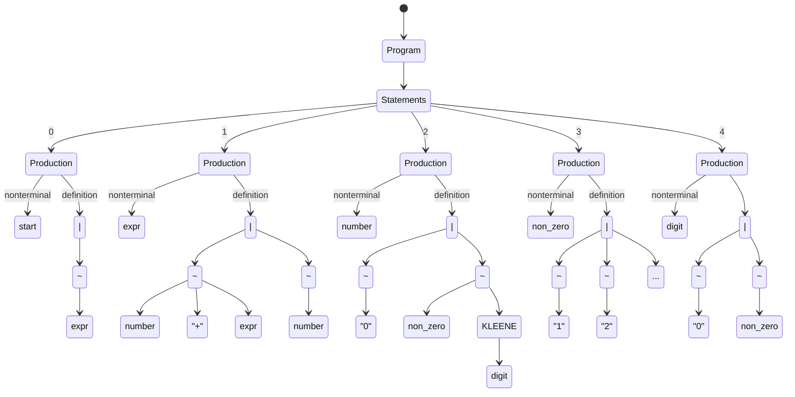
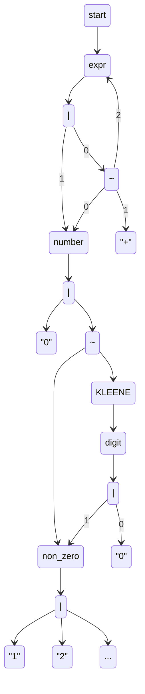
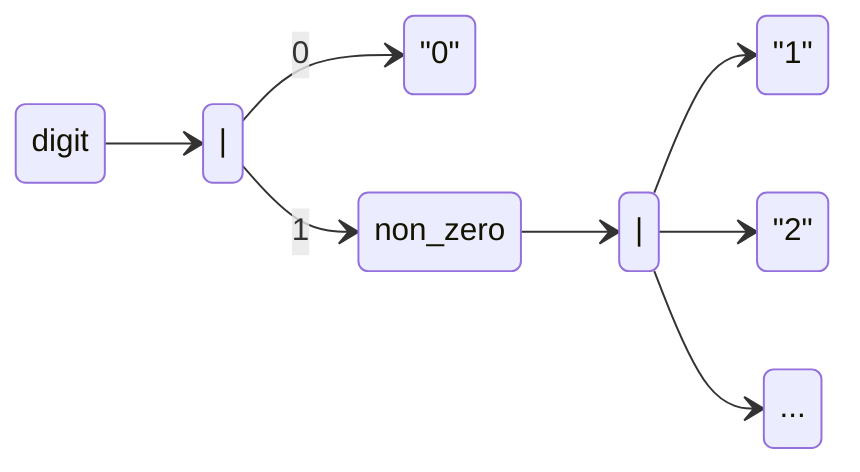
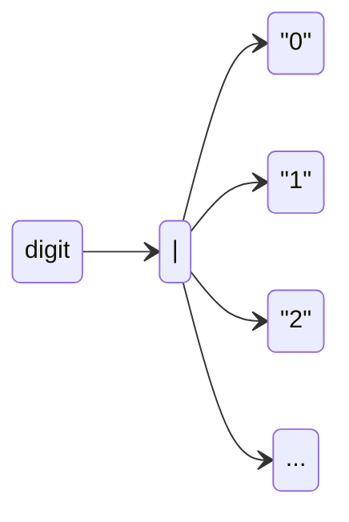
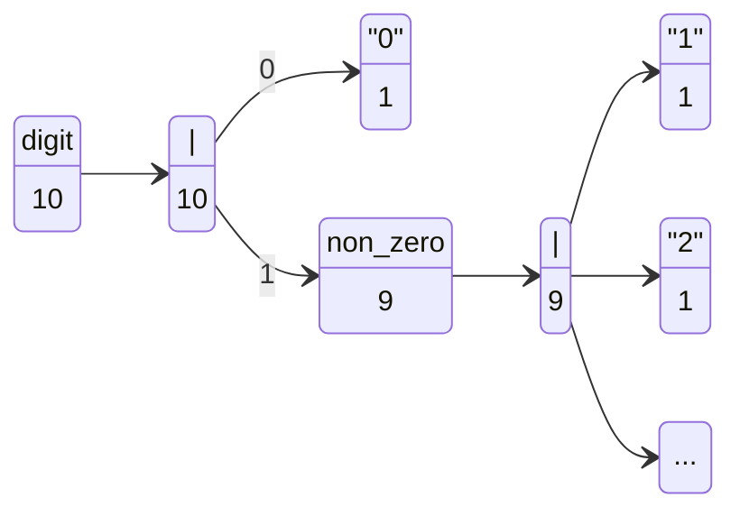

# fandango-rs

This crate implements a heavily-optimised subset
of [FANDANGO: Evolving Language-Based Testing](https://github.com/fandango-fuzzer/fandango), as a demonstration of "just
how fast it can get".

## Design

Our ultimate goal is to concretise every operation in FANDANGO into a compiler-optimisable representation. In FANDANGO,
there are four primary operations which take place:

- Parsing
- Generation
- Visitation (i.e., walking the nodes of the grammar)
- Constraining/Fitness evaluation

We describe the mechanism by which these components are made compiler-friendly individually, and incrementally describe
the theory throughout.

### Parsing

To implement parsing, we perform two tasks: transpilation of the FANDANGO grammar into [Pest](https://pest.rs), and
generation of corresponding Rust types which consume rules of the Pest grammar. For both of these steps, we first must
parse and "lift" the FANDANGO grammar into a transformable intermediary representation. The obvious representation here
is a _graph_ which represents the relationship between the components of the grammar.

Consider the following FANDANGO grammar:

```
<start> ::= <expr>;
<expr> ::= <number> "+" <expr> | <number>;
<number> ::= "0" | <non_zero><digit>*;
<non_zero> ::=
              "1"
            | "2"
            | "3"
            | "4"
            | "5"
            | "6"
            | "7"
            | "8"
            | "9"
            ;
<digit> ::= "0" | <non_zero>;
```

We first lift this into a classical derivation tree (encoded in concrete pre-defined types) which represents the
grammar.



This tree is then encoded into a graph with the following rules:

1. Program and statement nodes (and their edges) are removed
2. Productions are rewritten such that the definition edge's parent node is the associated nonterminal.
3. Alternatives with one child are removed and an edge added between the parent and child nodes.
4. Concatenations with one child are removed and an edge added between the parent and child nodes.
5. All nonterminal nodes with the same names are treated as equivalent (i.e. they are merged, with all their incoming
   and outgoing edges).

This results in a graph like the following (numbering provided to clarify edge order):



This graph represents the grammar as encoded into a graph, which now may trivially be converted into a Pest grammar and
corresponding Rust types quite easily. The Pest grammars may be encoded by simply recursively traversing non-terminal
nodes and emitting source code by DFS. The Rust types may be produced in a similar manner; each node represents a single
type (i.e. everything is a `struct` excluding alternations, which are encoded in an `enum`) where descendents are
fields, and the types for fields which represent edges to non-terminals are contained within a
[`Box`](https://doc.rust-lang.org/std/boxed/struct.Box.html) to prevent the encoding of infinitely-sized structures.
The corresponding parse-to-type code is similarly generated.

### Generation

To encode generation, we first define two primitives of generation: generators and samplers.

Samplers specify how the result of a random choice during generation is distributed. There are five classes of random
choice in sampling:

1. Selection of a number of repetitions of a Kleene Star operator (i.e. within `[0,∞)`)
2. Selection of a number of repetitions of a Plus operator (i.e. within `[1,∞)`)
3. Selection of a number of repetitions of an Optional operator (i.e. within `[0,1]`)
4. Selection of a number of repetitions of a fixed repetitions operator (i.e. within `[start,end]`)
5. Selection of an alternative variant

Generators specify how a node is generated. There are two ways in which this is performed:

1. The generator specifies, concretely, how to instantiate a given node (i.e. "this node represents a number, so
   generate a random number and parse it")
2. The generator _modifies the sampler_ and provides the biased sampler to the remaining generators.

In this way, generators and samplers work together to produce a given subtree. We define a generator with the trait,
`Generator`, and define a second trait, `GeneratorTuple`, which represents a
[Haskell-style](https://hackage.haskell.org/package/base-4.21.0.0/docs/Data-List.html) list. Additionally, the Rust code
generation described in the Parsing section includes an implementation of the `DefaultGenerated` trait, and a
`Generated` trait is blanket implemented for all `DefaultGenerated` implementors. Generation occurs by recursion, where
each node is produced by generating its children or by direct generation (e.g. the number generator described above).

The generator and sampler trait definitions looks like the following:

```rust
pub trait Sampler<N> {
    fn sample_kleene(&mut self) -> usize;
    fn sample_plus(&mut self) -> usize;
    fn sample_optional(&mut self) -> bool;
    fn sample_repetition(&mut self, lower: usize, upper: usize) -> usize;
    fn sample_alternative(&mut self, count: usize) -> usize;
}

pub trait DefaultGenerated<S, G> {
    fn generate_default(sampler: &mut S, with: &mut G) -> Self;
}

pub trait Generated<S, G> {
    fn generate(sampler: &mut S, with: &mut G) -> Self;
}

impl<N, S, G> Generated<S, G> for N
where
    N: DefaultGenerated<S, G>,
    G: GeneratorTuple<N, S>,
{
    fn generate(sampler: &mut S, with: &mut G) -> Self {
        with.generate(sampler)
            .unwrap_or_else(|| N::generate_default(sampler, with))
    }
}

pub trait Generator<N, W, S> {
    fn generate(&mut self, sampler: &mut S, with: &mut W) -> Option<N>;
}

pub trait GeneratorTuple<N, S> {
    fn generate(&mut self, sampler: &mut S) -> Option<N>;
}

impl<Head, Tail, N, S> GeneratorTuple<N, S> for (Head, Tail)
where
    Head: Generator<N, Tail, S>,
    Tail: GeneratorTuple<N, S>,
{
    fn generate(&mut self, sampler: &mut S) -> Option<N> {
        self.0
            .generate(sampler, &mut self.1)
            .or_else(|| self.1.generate(sampler))
    }
}
```

Four generics are present here: `N`, which represents the node which is generated; `W` or `G`, which each represent a
`GeneratorTuple` as we described above; and `S`, which represents a sampler. To highlight the reason for this pattern
as defined, we describe the steps of generation below:

1. First, you define your generators; let's suppose we have three: `let mut generators = tuple_list!(g1, g2, g3);`
2. Second, you specify your sampler -- by default, you can provide your own, or you can use anything which implements
   [`rand::rng`](https://docs.rs/rand/latest/rand/trait.Rng.html): `let mut sampler = thread_rng();`
3. You then invoke generation on some node type `N` directly: `N::generate(&mut sampler, &mut generators)`
    1. The generator first attempts to produce `N` by invoking the generators.
        1. Supposing that `g1` modifies the sampler for the production of `N`; then it creates a new sampler `s1` and
           returns (in effect) `Some(N::generate(&mut s1, &mut tuple_list!(g2, g3)))`, which will then continue
           recursing with the newly provided sampler.
        2. Supposing `g1` directly produces the type, then `Some(n)` is returned with the produced `n`.
        3. Supposing `g1` fails, then the procuess continues with `tuple_list!(g2, g3)`.
    2. Supposing none of the generators work, `N::default_generated(&mut sampler, &mut generators)` is invoked. This is
       automatically generated and implemented as one of the following:
        1. If `N` is a normal node, this will recurse with calling `::generate(&mut sampler, &mut generators)` on each
           of its children.
        2. If `N` is a repeated node, then it will sample a number of repetitions from the corresponding sampler methods
           and then use `::generate` to produce the specified number of children.
        3. If `N` is an alternation, it will sample a variant index of the alternation and then attempt to produce that
           variant with `::generate`.

In this way, nodes are randomly and recursively generated.

#### Example

We describe a _flattener_ generator. The purpose of this generator is to make the distribution of all recursive
terminals of a node equally likely to be produced. To illustrate the utility of this, consider the following subgraph of
the grammar defined above:



If we use the default generation strategy described previously, the `digit` node is 50% likely to be a 0 and ~5.5%
likely for each other terminal (1-9). This leads to a very unequal distribution of numbers produced. Instead, let's
imagine that we _elide_ the `non_zero` and its child alternative with the one above:



Now, we are equally likely to produce each terminal as a result of _flattening_ the `non_zero` nonterminal and its
alternative. Note that there is now effectively exactly one alternative.

To accomplish this in practice, we produce a modified selector by controlling the sampling of alternations to enforce
that the likelihood of producing each terminal is equal. We do so by recursively computing the number of _eventual_
terminals for each node:



Then, when we encounter the `digit` alternation, the flattener invokes the remaining generators with a sampler which has
already determined the choice (within `[0,9]`) of which terminal node will be selected. Suppose that we select the 7th;
at the first alternative, we see that the first choice (just `0`) contains 1 eventual terminal, which is less than 7, so
we subtract 1 from our choice; we then see that the second choice contains 9 eventual terminals, which is greater than
6, so we descend this alternative. At the next choice, we apply the same process to pick the 6th terminal[^1]. The
remaining generators are then allowed to generate the remaining nodes as they see fit, or fallback to default
generation.

To use this in practice, you might see the following code:

<!-- @formatter:off -->
```rust
let flattener = Flattener::new().flatten::<digit>(); // select digit to be flattened
let mut generators = tuple_list!(flattener, ...); // add to the list of generators
let mut sampler = thread_rng();
let start = start::generate(&mut sampler, &mut generators);
```
<!-- @formatter:on -->

[^1]: Internally, this selection process is optimised to use a binary search instead.

### Visitation

---

Before getting too into the weeds, it's worth noting that Rust enforces strict exclusive mutability guarantees with
something referred to as _the borrow checker_. For a full overview of what this entails, see the corresponding chapter
in [the Rust book](https://doc.rust-lang.org/book/ch04-00-understanding-ownership.html). For the purposes of this
section, the main thing you need to understand is that there are three states of a given variable:

1. Owned, which means that this code region or structure (the "owner") controls the destruction of a variable (i.e.,
   when it is "dropped").
2. Immutably borrowed, which means that this code region or structure provided the _reference_ has the ability to
   perform reading operations on the provided variable.
3. Mutably borrowed, which means that the code region or structure provided the reference has the ability to perform
   read and write operations on the provided variable.

When a value is borrowed in any form, it cannot be dropped (as this would invalidate the reference currently held
elsewhere). Similarly, if the value is borrowed in any form, it cannot then again be mutably accessed (as this would
potentially invalidate the reference's internal contents which may be held elsewhere). If the value is immutably
borrowed, then it may only be immutably borrowed again.

These properties are checked by the borrow checker at compile time, and care must be taken to manage the _lifetime_ of
references to ensure that the compiler can verify at all times that a variable is not dropped while references still
exist.

---

Visitors are critical machinery for performing operations over the derivation trees, such as when serialising the input
to string or performing mutations. To make this idiomatic for Rust, we need to ensure several qualities:

1. Visitor trait definitions must be generic so that code may be reused without needing to be generated for every
   grammar.
2. Lifetimes of grammar nodes must be preserved such that the borrow checker can ensure that mutable access is
   exclusive (recall: nodes actually represent entire subtrees in our type system!).
3. Common operations over nodes must be defined generically such that, even if we don't know the node's type, we can
   still perform the intended visitor operations on desired nodes.

#### Part 1: Opaque node types

To accomplish these qualities, we first introduce the concept of _opaque node types_. An opaque node is a wrapper around
a (potentially mutable) reference to a given node which allows for common operations on nodes even when the specific
type of the node is not known (for example, with generation described above). In practice, we generate two types for
opaque nodes, `Type` and `TypeMut`, which are defined as enums over immutable and mutable references of all node types
which are generated. Each node type then implements a trait, `Node`, which specifies these types via associated types:

```rust
pub trait Node {
    type Type<'program>
    where
        Self: 'program;
    type TypeMut<'program>
    where
        Self: 'program;
    // snipped
}
```

Note that `'program` here describes a _lifetime_ (i.e., a compiler hint for the period over which a value exists);
internally to the generated definitions of `Type` and `TypeMut`, this refers to the lifetimes attached to the node
references which they contain.

#### Part 2: The visitor

Below is the definition of the visitor trait:

```rust
pub trait Visitor<T> {
    type Continue;
    type Break;
    type Error;

    fn visit<'program, N>(self, node: &'program mut N, idx: usize) -> VisitResult<Self, T>
    where
        N: Node<TypeMut<'program>=T>,
        T: From<&'program mut N> + AsNodeMut<N>;
}

pub type VisitResult<V, T>
where
    V: Visitor<T>,
= Result<ControlFlow<V::Break, V::Continue>, V::Error>;
```

This is a lot to break down, so let's do it one part at a time. The trait `Visitor` is generic over `T`, a generic type
which represents `TypeMut` -- in other words, the opaque node type. This defines three associated types: `Continue`,
`Break`, and `Error`, which respectively represent what is returned when visitation should continue, visitation should
complete and the corresponding value be immediately returned, and the error type which is emitted when an error is
encountered while visiting. These values are returned in a `VisitResult`, which encodes the description in the previous
sentence.

The `visit` function itself is generic over a lifetime `'program` and a node type `N`, which specifies that any visitor
implementation must accept any mutable reference of lifetime `'program` to any type `N` such that `N` is a `Node`, where
its corresponding `TypeMut` definition is `T` for the lifetime `'program`, and that `T` (the opaque node type) is
constructable from a mutable reference to `N` with lifetime `'program`. In effect, this enforces that this function
may only be called with nodes composed of a single grammar with a single shared opaque node type.

The other item of note in the `visit` function is that it is a _consuming_ function; the visitor is _owned_ by the
function, which means that the visitor cannot be used again by the caller. In practice, this means that a visitor may
only be used to visit a single node. So how do we traverse a whole tree?

#### Part 3: VisitableChildren

We define a second trait, `VisitableChildren`, for which definitions are generated both for opaque nodes and _mutable
references to_ concrete nodes:

```rust
pub trait VisitableChildren<T> {
    fn visit_each<V>(self, visitor: V) -> VisitResult<V, T>
    where
        V: Visitor<T, Continue=V>;

    fn visit_each_reverse<V>(self, visitor: V) -> VisitResult<V, T>
    where
        V: Visitor<T, Continue=V>;

    fn visit_each_from<V>(self, visitor: V, idx: usize) -> VisitResult<V, T>
    where
        V: Visitor<T, Continue=V>;

    fn visit_each_reverse_from<V>(self, visitor: V, idx: usize) -> VisitResult<V, T>
    where
        V: Visitor<T, Continue=V>;

    fn visit_nth<V>(self, visitor: V, idx: usize) -> MaybeVisitResult<V, T>
    where
        V: Visitor<T>;
}

pub type MaybeVisitResult<V, T>
where
    V: Visitor<T>,
= Result<Result<ControlFlow<V::Break, V::Continue>, V::Error>, V>;
```

It is through this method that recursive access to trees becomes available. The `each` functions perform iteration over
each node, and the `nth` operation visits exactly one node. Once again, `T` refers to the opaque node type, and each
method is generic over `V` such that implementors must accept _any_ `V` where `V` is a `Visitor` over `T`.

Note especially how the iteration functions perform iteration: the visitors _must return itself_ in the case where
iteration continues, meaning that, in effect, the `visit` function consumes the visitor it is invoked upon, then returns
it to the caller so that the caller may use it again. This allows LLVM to optimise this function more effectively into
tail calls in most cases, but more importantly allows us to enforce certain properties about how visitors access nodes.

The purpose of `VisitableChildren` is to enable implementors of `Visitor` to perform iteration on any `N`, as `N` in
`visit` cannot be constrained further. Similarly, by ensuring these are consuming functions, the borrow checker may
ensure that mutable references and opaque nodes are _consumed_ and therefore _no longer borrowed_, which allows us to
perform operations like BFS while allowing the borrow checker to ensure that we are not mutably accessing a node more
than once at a time.

#### Example 1: `NodeCountVisitor`

Let's consider a simple example of a visitor which merely counts the number of nodes: `NodeCountVisitor`[^2]. We
implement the visitor like so:

```rust
pub struct NodeCountVisitor {
    count: usize,
}

impl<T> Visitor<T> for NodeCountVisitor
where
    T: VisitableChildren<T>,
{
    type Continue = Self;
    type Break = Infallible;
    type Error = Infallible;

    fn visit<'program, N>(mut self, node: &'program mut N, idx: usize) -> VisitResult<Self, T>
    where
        N: Node<TypeMut<'program>=T>,
        T: From<&'program mut N> + AsNodeMut<N>,
    {
        self.count += 1;
        T::from(node).visit_each(self)
    }
}
```

Of particular note is the generic bound `T: VisitableChildren<T>` which specifies that instances of `T` must implement
`VisitableChildren`. Because of the bound `T: From<&'program mut N>` of `visit`, we may construct the opaque node using
`T::from(node)`, then invoke the consuming function `visit_each` and pass the visitor as `self`. This, in practice,
leads to a pre-order traversal over each node.

This visitor is relatively simple to implement because we don't need to handle any bookkeeping with the nodes
themselves. But what if we needed to?

#### Example 2: `FindVisitor`

Suppose we want to find a node in a given derivation tree based on some criteria by BFS. This is normally done by
maintaining a work queue where one pops a node to search from the front of this queue and pushing its children to the
back. In Rust, we can only create a queue (idiomatically, a `VecDeque`) of the same type, and since `N` is potentially
different for each `visit` call, we cannot construct a queue out of nodes directly. Thankfully, we can show that `T` is
consistent (because `N: Node<TypeMut<'program> = T>` at each callsite), so we can construct `VecDeque<T>`.

Similarly, we cannot have mutable access to both a node and its children as this would break the exclusive mutability
rule from the borrow checker (remember: a node is actually a full subtree!). When we traverse a given parent, we must
prove to the borrow checker that we do not maintain a reference to the parent node -- which is why the `visit_each`
implementation consumes the opaque node, in order to ensure that the mutable reference contained therein is also
consumed.

Below is an implementation with these qualities, with comments:

<details>

<summary>Implementation of FindVisitor (BFS)</summary>

```rust
impl<T> Visitor<T> for FindVisitor
where
    T: VisitableChildren<T>,
{
    type Continue = Self; // allow for repeated use
    type Break = VecDeque<usize>; // return the path to the target node
    type Error = Infallible;

    fn visit<'program, N>(self, node: &'program mut N, idx: usize) -> VisitResult<Self, T>
    where
        N: Node<TypeMut<'program>=T>,
        T: From<&'program mut N> + AsNodeMut<N>,
    {
        // create a list to track the parent->child index of each node
        let mut stack = Vec::new();

        // create a work queue
        let mut work = VecDeque::new();
        // init the queue with the provided node; it has no parent, its index is provided
        work.push_back((usize::MAX, idx, T::from(node)));

        // helper type to check and collect child nodes
        struct ChildCollector<'a, T> {
            predicate: /* somehow identify the node */,
            parent: usize,
            work: &'a mut VecDeque<(usize, usize, T)>,
        }

        impl<T> Visitor<T> for ChildCollector<'_, T> {
            type Continue = Self;
            type Break = usize;
            type Error = Infallible;

            fn visit<'program, N>(self, node: &'program mut N, idx: usize) -> VisitResult<Self, T>
            where
                N: Node,
                T: From<&'program mut N> + AsNodeMut<N>,
            {
                // if the child matches the predicate, return its index
                if self.predicate(node) {
                    return Ok(ControlFlow::Break(idx));
                }
                // otherwise, collect it in the work queue
                self.work.push_back((self.parent, idx, t));
                Ok(ControlFlow::Continue(self))
            }
        }

        while let Some((parent, idx, next)) = work.pop_front() {
            // record the index of the parent in the stack and actual index for this node
            let next_parent = stack.len();
            stack.push((parent, idx));

            // construct the child collector
            let collector = ChildCollector {
                predicate: self.predicate,
                parent: next_parent,
                work: &mut work,
            };

            // visit each child with the collector
            match next.visit_each(collector)? {
                ControlFlow::Continue(_) => {} // nothing to do if the collector is returned
                ControlFlow::Break(c) => {
                    // construct a path to the node by traversing the stack
                    let mut path = VecDeque::new();
                    let mut parent = next_parent;
                    path.push_front(c);
                    while parent != 0 {
                        let (next_parent, idx) = stack[parent];
                        path.push_front(idx);
                        parent = next_parent;
                    }
                    path.push_front(stack[0].1);
                    return Ok(ControlFlow::Break(path));
                }
            }
        }

        Ok(ControlFlow::Continue(self))
    }
}
```

</details>

In this way, we may visit the whole subtree while maintaining the typing requirements and exclusive access required by
Rust.

#### Example 3: Mutation

Of course, we want to be able to perform mutation if we are seeking to do an evolutionary algorithm. To do so, we begin
by defining two utility traits for the opaque node types:

```rust
pub trait InPlaceGenerated<'a, S, G> {
    fn generate_in_place(&'a mut self, sampler: &mut S, with: &mut G);
}

pub trait VisitWith<'a, V>: Sized {
    type Visited;

    fn visit_with(&'a mut self, visitor: V, idx: usize) -> VisitResult<V, Self::Visited>
    where
        V: Visitor<Self::Visited>;
}
```

Note that these both accept a _mutable reference to_ the opaque node type rather than consuming it, like we did with
`VisitableChildren`. This is to allow us to repeatedly perform mutation on a node, e.g. if we want to perform other
operations on the same node. With this machinery in place, we may now implement our mutator.

To do so, assume the presence of a `start` node which represents the start of our grammar. We want to uniformly select a
node for mutation. To do so, we may first simply count the number of nodes present within the tree and sample this
uniformly; a `count_nodes` function is blanket defined to allow for easy usage of `NodeCountVisitor` like so:

```rust
fn mutate<R: Rng>(rng: &mut R, node: start, times: usize) -> start {
    for _ in 0..times {
        let count = node.count_nodes();
        let selection = rng.gen_range(0..count);
        // TODO
    }
}
```

Next, we need to traverse the tree to that node. This may be done with the `Advance` visitor, which simply performs
pre-order traversal and returns the nth node.

<details>

<summary>Implementation of the Advance visitor</summary>

```rust
impl<T> Visitor<T> for Advance
where
    T: VisitableChildren<T>,
{
    type Continue = Self;
    type Break = T;
    type Error = Infallible;

    fn visit<'program, N>(mut self, node: &'program mut N, _: usize) -> VisitResult<Self, T>
    where
        N: Node<TypeMut<'program>=T>,
        T: From<&'program mut N> + AsNodeMut<N>,
    {
        if self.count == self.target {
            return Ok(ControlFlow::Break(T::from(node)));
        }
        self.count += 1;
        match T::from(node).visit_each(self)? {
            ControlFlow::Continue(visitor) => Ok(ControlFlow::Continue(visitor)),
            b => Ok(b),
        }
    }
}
```

</details>

Now that we can traverse to a node uniformly, we may simply use `InPlaceGenerated::generate_in_place` to perform the
generation (and thereby mutation) of the opaque node. Note that in this way, we only mutate this specific subtree:

```rust
fn mutate<R: Rng>(rng: &mut R, node: start, times: usize) -> Result<start, Box<dyn Error>> {
    for _ in 0..times {
        let count = node.count_nodes();
        let selection = rng.gen_range(0..count);

        let mut target = Advance::forward(selection)
            .visit(&mut start, 0)?
            .break_value()
            .unwrap();
        // no custom generators used, but you could easily add them
        target.generate_in_place(&mut rng, &mut ());
    }
    Ok(node)
}
```

This mutates the node in place. As a matter of optimisation, we can avoid counting the whole tree every time by counting
the mutated derivation tree before and after mutation:

```rust
fn mutate<R: Rng>(rng: &mut R, node: start, times: usize) -> Result<start, Box<dyn Error>> {
    let mut count = node.count_nodes();
    for _ in 0..times {
        let selection = rng.gen_range(0..count);

        let mut target = Advance::forward(selection)
            .visit(&mut start, 0)?
            .break_value()
            .unwrap();

        let old_count = target.count_nodes();

        // no custom generators used, but you could easily add them
        target.generate_in_place(&mut rng, &mut ());

        let new_count = target.count_nodes();
        count = count - old_count + new_count;
    }
    Ok(node)
}
```

In this way we have created an efficient mutator; at compile time, the count operations are wildly optimised, so this
ends up being just about as efficient as counting the nodes once.

### Constraining

TODO

[^2]: This is implemented slightly differently in the actual version for support of `StartingFrom`, but you can read the
documentation for that if you need.

## Licensing

This crate is licensed under EUPL v1.2.

Some sections of the code are adaptations of [py_literal](https://github.com/jturner314/py_literal/releases/tag/0.4.0),
which is licensed under Apache and MIT, for which license files are provided
in [core/src/py_literal](fandango/src/py_literal).
