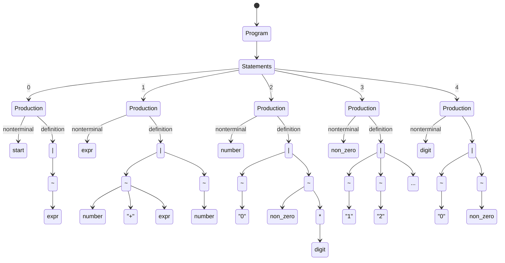
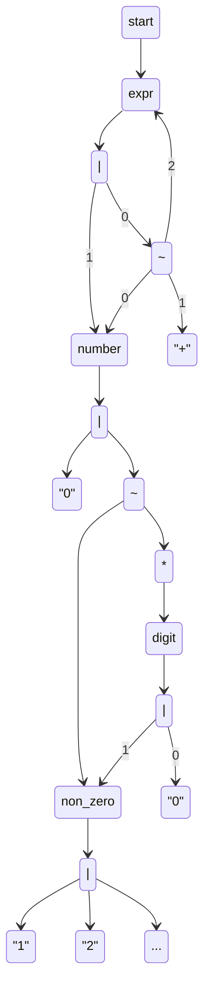
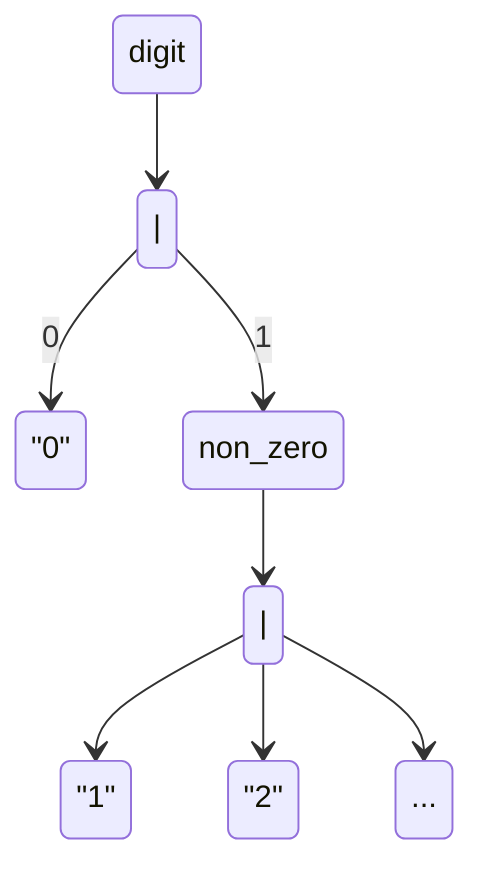
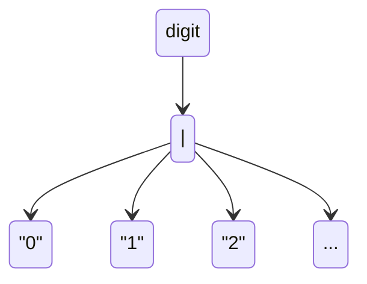

# fandango-rs

This crate implements a heavily-optimised subset
of [FANDANGO: Evolving Language-Based Testing](https://github.com/fandango-fuzzer/fandango), as a demonstration of "just
how fast it can get".

## Theory

Our ultimate goal is to concretise every operation in FANDANGO into a compiler-optimisable representation. In FANDANGO,
there are four primary operations which take place:

- Parsing
- Generation
- Visitation (i.e., walking the nodes of the grammar)
- Constraining/Fitness evaluation

We describe the mechanism by which these components are made compiler-friendly individually, and incrementally describe
the theory throughout.

### Parsing

To implement parsing, we perform two tasks: transpilation of the FANDANGO grammar into [Pest](https://pest.rs), and
generation of corresponding Rust types which consume rules of the Pest grammar. For both of these steps, we first must
parse and "lift" the FANDANGO grammar into a transformable intermediary representation. The obvious representation here
is a _graph_ which represents the relationship between the components of the grammar.

Consider the following FANDANGO grammar:

```
<start> ::= <expr>;
<expr> ::= <number> "+" <expr> | <number>;
<number> ::= "0" | <non_zero><digit>*;
<non_zero> ::=
              "1"
            | "2"
            | "3"
            | "4"
            | "5"
            | "6"
            | "7"
            | "8"
            | "9"
            ;
<digit> ::= "0" | <non_zero>;
```

We first lift this into a classical derivation tree (encoded in concrete pre-defined types) which represents the
grammar.



This tree is then encoded into a graph with the following rules:

1. Program and statement nodes (and their edges) are removed
2. Productions are rewritten such that the definition edge's parent node is the associated nonterminal.
3. Alternatives with one child are removed and an edge added between the parent and child nodes.
4. Concatenations with one child are removed and an edge added between the parent and child nodes.
5. All nonterminal nodes with the same names are treated as equivalent (i.e. they are merged, with all their incoming
   and outgoing edges).

This results in a graph like the following (numbering provided to clarify edge order):



This graph represents the grammar as encoded into a graph, which now may trivially be converted into a Pest grammar and
corresponding Rust types quite easily. The Pest grammars may be encoded by simply recursively traversing non-terminal
nodes and emitting source code by DFS. The Rust types may be produced in a similar manner; each node represents a single
type (i.e. everything is a `struct` excluding alternations, which are encoded in an `enum`) where descendents are
fields, and the types for fields which represent edges to non-terminals are contained within a
[`Box`](https://doc.rust-lang.org/std/boxed/struct.Box.html) to prevent the encoding of infinitely-sized structures.
The corresponding parse-to-type code is similarly generated.

### Generation

To encode generation, we first define two primitives of generation: generators and samplers.

Samplers specify how the result of a random choice during generation is distributed. There are five classes of random
choice in sampling:

1. Selection of a number of repetitions of a Kleene Star operator (i.e. within `[0,∞)`)
2. Selection of a number of repetitions of a Plus operator (i.e. within `[1,∞)`)
3. Selection of a number of repetitions of an Optional operator (i.e. within `[0,1]`)
4. Selection of a number of repetitions of a fixed repetitions operator (i.e. within `[start,end]`)
5. Selection of an alternative variant

Generators specify how a node is generated. There are two ways in which this is performed:

1. The generator specifies, concretely, how to instantiate a given node (i.e. "this node represents a number, so
   generate a random number and parse it")
2. The generator _modifies the sampler_ and provides the biased sampler to the remaining generators.

In this way, generators and samplers work together to produce a given subtree. We define a generator with the trait,
`Generator`, and define a second trait, `GeneratorTuple`, which represents a
[Haskell-style](https://hackage.haskell.org/package/base-4.21.0.0/docs/Data-List.html) list. Additionally, the Rust code
generation described in the Parsing section includes an implementation of the `DefaultGenerated` trait, and a
`Generated` trait is blanket implemented for all `DefaultGenerated` implementors. Generation occurs by recursion, where
each node is produced by generating its children or by direct generation (e.g. the number generator described above).

The generator and sampler trait definitions looks like the following:

```rust
pub trait Sampler<N> {
    fn sample_kleene(&mut self) -> usize;
    fn sample_plus(&mut self) -> usize;
    fn sample_optional(&mut self) -> bool;
    fn sample_repetition(&mut self, lower: usize, upper: usize) -> usize;
    fn sample_alternative(&mut self, count: usize) -> usize;
}

pub trait DefaultGenerated<S, G> {
    fn generate_default(sampler: &mut S, with: &mut G) -> Self;
}

pub trait Generated<S, G> {
    fn generate(sampler: &mut S, with: &mut G) -> Self;
}

impl<N, S, G> Generated<S, G> for N
where
    N: DefaultGenerated<S, G>,
    G: GeneratorTuple<N, S>,
{
    fn generate(sampler: &mut S, with: &mut G) -> Self {
        with.generate(sampler)
            .unwrap_or_else(|| N::generate_default(sampler, with))
    }
}

pub trait Generator<N, W, S> {
    fn generate(&mut self, sampler: &mut S, with: &mut W) -> Option<N>;
}

pub trait GeneratorTuple<N, S> {
    fn generate(&mut self, sampler: &mut S) -> Option<N>;
}

impl<Head, Tail, N, S> GeneratorTuple<N, S> for (Head, Tail)
where
    Head: Generator<N, Tail, S>,
    Tail: GeneratorTuple<N, S>,
{
    fn generate(&mut self, sampler: &mut S) -> Option<N> {
        self.0
            .generate(sampler, &mut self.1)
            .or_else(|| self.1.generate(sampler))
    }
}
```

Four generics are present here: `N`, which represents the node which is generated; `W` or `G`, which each represent a
`GeneratorTuple` as we described above; and `S`, which represents a sampler. To highlight the reason for this pattern
as defined, we describe the steps of generation below:

1. First, you define your generators; let's suppose we have three: `let mut generators = tuple_list!(g1, g2, g3);`
2. Second, you specify your sampler -- by default, you can provide your own, or you can use anything which implements
   [`rand::rng`](https://docs.rs/rand/latest/rand/trait.Rng.html): `let mut sampler = thread_rng();`
3. You then invoke generation on some node type `N` directly: `N::generate(&mut sampler, &mut generators)`
    1. The generator first attempts to produce `N` by invoking the generators.
        1. Supposing that `g1` modifies the sampler for the production of `N`; then it creates a new sampler `s1` and
           returns (in effect) `Some(N::generate(&mut s1, &mut tuple_list!(g2, g3)))`, which will then continue
           recursing with the newly provided sampler.
        2. Supposing `g1` directly produces the type, then `Some(n)` is returned with the produced `n`.
        3. Supposing `g1` fails, then the procuess continues with `tuple_list!(g2, g3)`.
    2. Supposing none of the generators work, `N::default_generated(&mut sampler, &mut generators)` is invoked. This is
       automatically generated and implemented as one of the following:
        1. If `N` is a normal node, this will recurse with calling `::generate(&mut sampler, &mut generators)` on each
           of its children.
        2. If `N` is a repeated node, then it will sample a number of repetitions from the corresponding sampler methods
           and then use `::generate` to produce the specified number of children.
        3. If `N` is an alternation, it will sample a variant index of the alternation and then attempt to produce that
           variant with `::generate`.

In this way, nodes are randomly and recursively generated.

#### Example

We describe a _flattener_ generator. The purpose of this generator is to make the distribution of all recursive
terminals of a node equally likely to be produced. To illustrate the utility of this, consider the following subgraph of
the grammar defined above:



If we use the default generation strategy described previously, the `digit` node is 50% likely to be a 0 and ~5.5%
likely for each other terminal (1-9). This leads to a very unequal distribution of numbers produced. Instead, let's
imagine that we _elide_ the `non_zero` and its child alternative with the one above:



Now, we are equally likely to produce each terminal.

## Licensing

This crate, like most others, uses dual-license MIT and Apache.

Some sections of the code are adaptations of [py_literal](https://github.com/jturner314/py_literal/releases/tag/0.4.0),
which is similarly licensed, for which license files are provided in [core/src/py_literal](fandango/src/py_literal).
